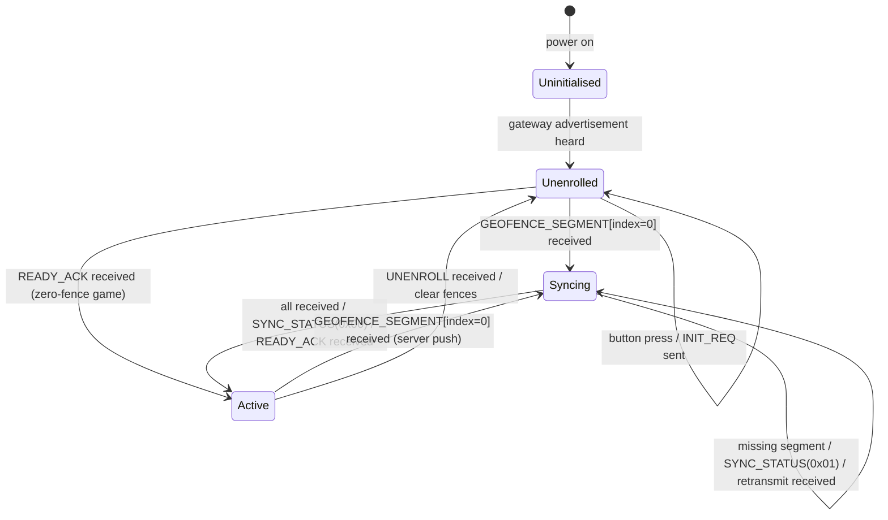

# Device Design

This document describes the GPS game player device: its state machine, hardware assumptions, persistent storage, and firmware module structure.

## Hardware Assumptions

Based on `examples/simple_sensor`. Minimum required:

- **LoRa radio** — mesh transport (RadioLib, SX1276 or compatible)
- **GPS module** — NMEA over UART (e.g. u-blox NEO-M8, Air530)
- **User button** — single momentary button, used for enrollment and manual check-in
- **LED or small display** — state feedback to the player and organiser
- **Flash / NVS** — non-volatile storage for gateway ID and geofence set

## State Machine



### Uninitialised

The device has no known gateway. It listens passively for a gateway advertisement broadcast on the mesh.

- GPS is running to acquire a fix for use in the first `INIT_REQ`.
- No mesh transmissions are sent.
- Button press has no effect (or shows a "no gateway" feedback flash).

Transitions to **Unenrolled** on receiving a gateway advertisement.

### Unenrolled

The device knows its gateway node ID but is not assigned to a game.

- GPS continues running.
- On button press: send `INIT_REQ`. The device stays in **Unenrolled** — there is no intermediate enrolling state.
- The server is silent when the organiser has not yet assigned the device. The device simply waits; the player presses the button again to retry.
- `GEOFENCE_SEGMENT` and `READY_ACK` are accepted at any time in this state. The server sends them in response to an `INIT_REQ` once the organiser assigns the device — which may be seconds or minutes after the last button press.
- On receiving `GEOFENCE_SEGMENT` with `segment_index = 0`: transition to **Syncing**.
- On receiving `READY_ACK` (zero-fence / button-only game): transition to **Active**.

### Syncing

The device is accumulating geofence segments. This state is entered both during initial enrollment and when the server pushes a new fence set mid-game.

- Received segments are stored in order.
- After all `segment_count` segments have arrived: send `SYNC_STATUS(status=0x00)` and wait for `READY_ACK`.
- If a segment is missing after `SYNC_RETRY_DELAY`: send `SYNC_STATUS(status=0x01, expected_index=N)` to request retransmission; remain in **Syncing**.

Transitions to **Active** on receiving `READY_ACK`.

### Active

The device is enrolled and participating in the game.

- GPS is polled continuously; geofence evaluation runs on each fix.
- On entering a geofence: send `EVENT_REPORT(event_type=0x00)`.
- On button press: send `EVENT_REPORT(event_type=0x01)`.
- If `PING_INTERVAL` elapses since the last report: send `EVENT_REPORT(event_type=0x02)`.
- All `EVENT_REPORT` packets wait for `EVENT_ACK`; retry up to `EVENT_RETRY_COUNT` times.
- On receiving `UNENROLL`: clear fences from NVS, transition to **Unenrolled**.
- On receiving `GEOFENCE_SEGMENT` with `segment_index = 0` (server push): discard current fences, transition to **Syncing**.

## State Persistence Across Power Cycles

A device that powers off mid-game should not need to re-enrol from scratch. Persist the following to NVS:

| Item | Restores to state |
|------|-------------------|
| Gateway node ID only | **Unenrolled** (skip Uninitialised) |
| Gateway node ID + geofence set + enrolled flag | **Active** (skip enrollment) |

On power-on: if a valid gateway ID and complete fence set are present in NVS, start in **Active**. If only a gateway ID is present, start in **Unenrolled**. If NVS is empty or the enrolled flag is absent, start in **Uninitialised**.

Receiving `UNENROLL` must clear the enrolled flag, the fence set, and the game association from NVS. The gateway node ID may be retained (the device stays in **Unenrolled** rather than going back to **Uninitialised**).

## Timers and Retry Parameters

Enrollment has no firmware timeout or retry. The organiser assigns the device via the game UI; the player presses the button when told to. That human loop is the retry mechanism.

| Parameter | Suggested default | Notes |
|-----------|-------------------|-------|
| `PING_INTERVAL` | 5 min | Time since last `EVENT_REPORT` before a location ping is sent |
| `SYNC_RETRY_DELAY` | 3 s | Delay before sending `SYNC_STATUS` for a missing segment |
| `EVENT_RETRY_DELAY` | 5 s | Delay between `EVENT_REPORT` retransmissions |
| `EVENT_RETRY_COUNT` | 3 | Maximum retries before giving up on an event |

All are compile-time constants initially; make them configurable only when there is a concrete reason to do so.

## LED / Display Indicators

The device must be observable without a screen. The pattern column is sufficient for a single-colour LED (T1000-E, nRF52 targets). The colour column is used when an RGB LED is available; on single-colour hardware it is ignored.

| State | Pattern | RGB colour |
|-------|---------|------------|
| Uninitialised | Slow single blink — 2 s period | Blue |
| Unenrolled | Double blink — 1 s period | Yellow |
| Syncing | Rapid blink — 200 ms period | Yellow |
| Active (idle) | Slow heartbeat — on 100 ms, off 1900 ms | Green |
| Event sent | Solid 500 ms flash, then resume Active | White |
| UNENROLL received | Three rapid flashes, then Unenrolled pattern | Red |

The `led_indicator` module should accept a `bool has_rgb` flag set at build time. When false it drives a single GPIO with the pattern only; when true it drives R/G/B channels and applies both pattern and colour.

If a small OLED or e-ink display is present, show: current state name, GPS fix status (no fix / 2D / 3D), and the time of the last event sent.

Design rule: the LED patterns are driven entirely by the state machine. No module other than `led_indicator` touches the LED hardware, and `led_indicator` takes its cue from the current state enum. This keeps the UI testable independently of radio and GPS behaviour.

## Firmware Module Structure

```
device/
  main.cpp              — setup(), loop(), wires modules together
  state_machine.h/cpp   — state enum, transition logic, owns all state changes
  gps_manager.h/cpp     — NMEA parsing, fix quality, latlon_t conversion
  fence_store.h/cpp     — NVS read/write, segment accumulation, geofence evaluation
  mesh_comms.h/cpp      — MeshCore REQ/RESPONSE send/receive, retry scheduler
  led_indicator.h/cpp   — LED patterns keyed to state enum
  protocol.h            — packet structs, type constants, latlon_t, time_t typedefs
```

The state machine owns all transitions. Other modules expose functions and fire callbacks; they do not drive state changes directly. For example, `gps_manager` calls a registered callback when a geofence is entered; the state machine decides whether to act on it based on the current state.
