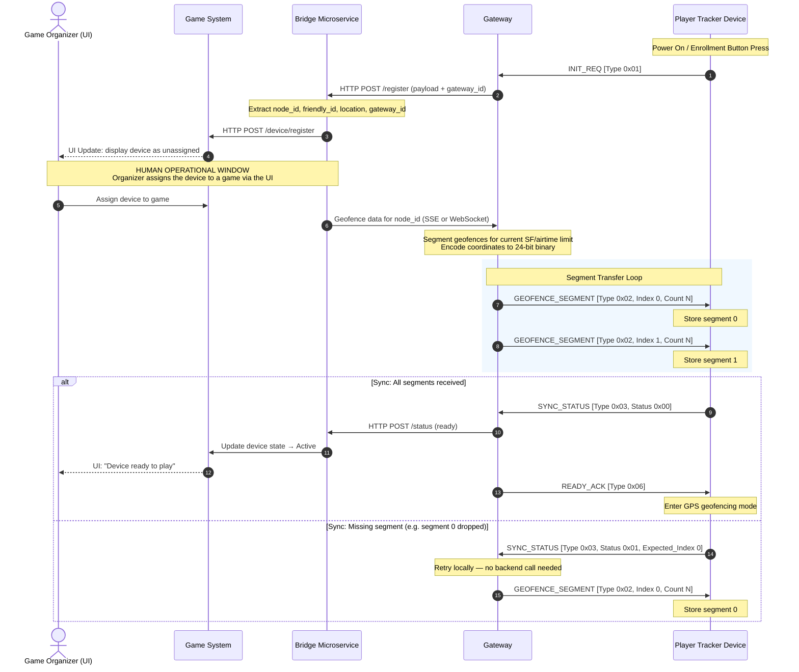
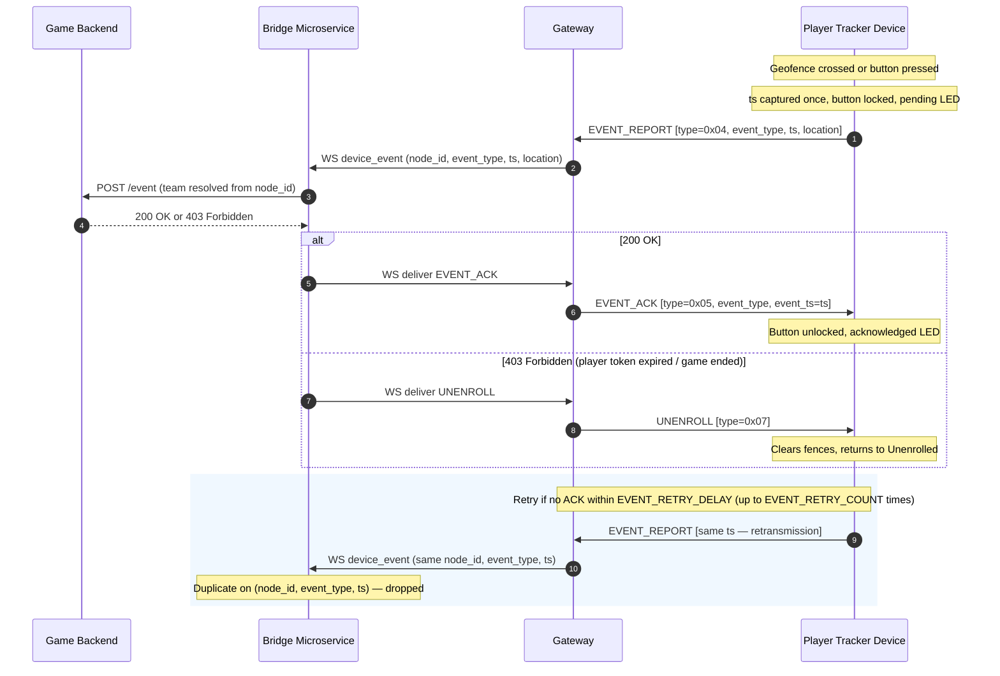

# GPS Game Protocol

This document defines the message formats and packet layouts for the GPS game example.

## Mesh packet framing

The design uses MeshCore `PAYLOAD_TYPE_REQ` and `PAYLOAD_TYPE_RESPONSE` packets for reliable device-server exchanges.

- `INIT_REQ`, `SYNC_STATUS`, and `EVENT_REPORT` are sent as requests from the device.
- `GEOFENCE_SEGMENT`, `READY_ACK`, `EVENT_ACK`, and `UNENROLL` are sent as responses from the server via the gateway device.
- `GEOFENCE_SEGMENT` may also be sent unsolicited by the server at any time to replace the device's current fence set.

All app payloads are encrypted using MeshCore shared secrets.

## Typedefs

`time_t` — 64-bit POSIX timestamp (seconds). Per-second granularity is sufficient to resolve "who reached the checkpoint first" questions. Size: 8 bytes.

`latlon_t` — compact location encoding. Latitude and longitude are each encoded into 24 bits, giving 1.2 cm latitude resolution and worst-case 2.4 cm longitude resolution — well within the accuracy of consumer GPS hardware. Size: 6 bytes.

## Gateway Broadcast Process

The gateway broadcast process allows a gateway to broadcast its presence in
the mesh to nearby player devices. We should consider whether to require this to
be a direct contact, in which case the game organiser must power up the devices
near to their gateway, or whether to allow the player devices to connect to any
gateway they hear, favouring the closest to them. We must also solve the question
of authentication, to avoid a rogue gateway intercepting game packets.

An initial system will only have one gateway. If this system ever scaled then there
could be many. The ultimate common ground is the back-end game service that the
gateway talks to over the Internet. The owner of the game service would own the gateway and the devices, so allowing a pre-shared key to be baked into firmware.

The gateway would broadcast on power on, on user demand (button press is simplest)
and could broadcast at infrequent intervals. We could use a MeshCore Region to limit
flooding to a geographically contained mesh owned by the game organiser. (Such a mesh may also want to configure its radios to avoid the public MeshCore network). More configuration complexity would require a companion app or other means to configure (serial console like a Repeater perhaps).

TODO: Design the broadcast made by the gateway.

The state of the device before it has a gateway should be shown by LED colour or
flash pattern (or display if we have one).

Once a device has a gateway it enters the Unenrolled State.

## Device Enrollment Process

### 1. INIT_REQ

Sent by the device at startup and on button press until enrolled.
This directly targets the previously found gateway.

Device should show that it is not enrolled by LED colour or flash pattern
for a display-less device. (Design this system such that the engine is observable and the UI sits on top of it.)

If the game is not yet ready to assign the device (organiser has not yet assigned it to a game), the server does not respond. The device retries on each button press. When the organiser assigns the device, the server will respond to the next `INIT_REQ` with `GEOFENCE_SEGMENT` packets.

Fields:
- `uint8_t type` = `0x01`
- `uint8_t version` — protocol version
- `uint32_t node_id` — device Mesh ID
- `uint8_t friendly_id` — human-readable device number, matching the label affixed to the hardware (1–255)
- `latlon_t location` — device current location (used as a hint to which game/event)
- `time_t ts` — GPS-derived timestamp

Total size: 21 bytes

### 2. GEOFENCE_SEGMENT

Sent by the server to transfer geofences in compact form. The message consists of one or more packets. Packets use the LoRa Explicit Header mode so packet length is provided by the radio layer (RadioLib).

If no geofences are required (button-press-only game), the server sends zero segments and proceeds directly to `READY_ACK`.

The server may push a new geofence set to the device at any time (e.g. mid-game course correction). On receiving a segment with `segment_index = 0`, the device discards its current fence set and starts accumulating the new one. The normal `SYNC_STATUS` / retry handshake applies.



#### Header (5 bytes)
- `uint8_t type` = `0x02`
- `uint8_t version` — protocol version
- `uint8_t segment_index`
- `uint8_t segment_count`
- `uint8_t flags` — reserved, set to 0

#### FenceEntry (7 bytes each)
- `latlon_t centre` — 6 bytes
- `uint8_t radius_flags`
  - bits 0–6: radius in metres (0–127)
  - bit 7: compound fence indicator (this entry extends the previous fence)

Total size: 5 + N×7 bytes. At the SF7/SF8 LoRa payload limit (222 bytes): maximum 31 entries per packet.

### 3. SYNC_STATUS

Sent by the device after receiving geofence segments: either to confirm all segments arrived, or to request retransmission of a missing segment.

Fields:
- `uint8_t type` = `0x03`
- `uint8_t status` — `0x00` = all segments received, `0x01` = missing segment
- `uint8_t expected_index` — index of the missing segment when status = `0x01`; `0x00` otherwise

Total size: 3 bytes

### 4. EVENT_REPORT

Sent by the device when the player enters a geofence or presses the button.

Fields:
- `uint8_t type` = `0x04`
- `uint8_t version` — protocol version
- `latlon_t location` — 6 bytes
- `time_t ts` — 8 bytes. Captured once when the event occurs; preserved unchanged on retransmissions. Together with `node_id` and `event_type`, this is the event's unique ID for bridge-level deduplication.
- `uint8_t event_type`
  - `0x00` = automatic geofence entry
  - `0x01` = user-initiated (button press)
  - `0x02` = periodic location ping (no game event; device has not reported for a while and is broadcasting its current position)

Total size: 17 bytes

### 5. EVENT_ACK

Sent by the server to acknowledge event receipt.

Fields:
- `uint8_t type` = `0x05`
- `uint8_t event_type`
- `time_t event_ts` — timestamp of the acknowledged event, echoed from `EVENT_REPORT.ts`. The device uses this to match the ACK to its pending event and stop retrying.

Total size: 10 bytes

### Event reporting sequence



### 6. READY_ACK

Sent by the server after the device has successfully synchronised all geofence segments and the game assignment is confirmed. Closes the enrollment handshake: the device knows its `SYNC_STATUS` was received.

Fields:
- `uint8_t type` = `0x06`
- `uint8_t status` — `0x00` = enrolled and ready, non-zero values reserved for error codes
- `uint32_t game_id` — game identifier (informational; the device does not need to act on this)

Total size: 6 bytes

### 7. UNENROLL

Sent by the server in response to any `EVENT_REPORT` when the device is no longer assigned to an active game. The device assumes it is enrolled until it receives this message, so it will naturally receive `UNENROLL` on the first event it sends after game-over — whether that is a button press (from a user trying to re-enrol) or a periodic location ping (from a device the user forgot to power off).

Fields:
- `uint8_t type` = `0x07`

Total size: 1 byte

On receipt the device must:
- Clear its stored geofence set
- Return to unenrolled state
- Resume sending `INIT_REQ` on each button press to join a new game

## Transport and scope

### Region-based flood scoping

The MeshCore `RegionMap` should be used for transport scoping among game routers.

- game routers can be assigned a region/flood scope
- device startup and event reports can use direct or scoped flood
- the server should reply using the same transport scope when possible

### Direct vs flood delivery

- `INIT_REQ` and `EVENT_REPORT` should use direct routing when the server path is known.
- If the path is not known, the packet may use flood routing within the game scope.
- Server responses should use direct response if the device path is known, else flood reply.

## HTTP bridge payloads

The server forwards game events to the backend via HTTP POST.
Recommended JSON shape:

```json
{
  "node_id": 1234,
  "friendly_id": 42,
  "game_id": 7,
  "event_type": "arrival",
  "event_mode": "auto",
  "lat": 51234567,
  "lon": -12345678,
  "timestamp": 1710000000
}
```

For device ready notifications:
```json
{
  "node_id": 1234,
  "friendly_id": 42,
  "game_id": 7,
  "status": "ready",
  "timestamp": 1710000000
}
```

Note: `team_id` is not stored on the device. The bridge maintains the node→team mapping and adds it when calling the game API.
